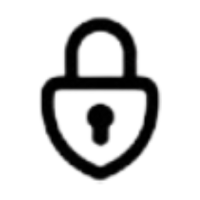

<p align="center">
  <!-- Insert logo here -->
  
</p>

<h1 align="center">KeepMeSafe (KMS) </h1>

<p align="center">
  🔐 A secure, multi-profile password manager inspired by KeePass. <br/>
  Your vaults, encrypted and in your hands.
</p>

---

## 🚀 About the Project

**KeepMeSafe** is a minimalist, self-hosted password manager built with Django and SQLite.  
It allows users to create separate encrypted vaults under different profiles, each protected with a master key.  
Inspired by simplicity and security, KeepMeSafe is perfect for individual use or as a base for more complex multi-user systems.

---

## 🧰 Features

- 🔐 Encrypted vaults (one per profile)
- 🧑‍💻 Multi-profile support
- 🛡️ Admin-protected profile creation
- 💾 SQLite-backed for easy deployment
- 📦 Docker-ready
- 🖥️ Clean and modern UI with TailwindCSS

---

## ⚙️ Tech Stack

- **Backend**: Django, Python
- **Frontend**: HTML + TailwindCSS
- **Database**: SQLite
- **Deployment**: Docker (optional)

---

## 📸 Screenshots

Here are some screenshots showcasing the features of KeepMeSafe:

1. **Main Page**  
   

2. **Create Vault**  
   

3. **Vault**  
   

4. **Edit Credential**  
   

---

## 🚧 How to Run

### Manually

First clone the repository in your machine and install the dependencies.
```bash
git clone https://github.com/pointedsec/keepmesafe.git
cd keepmesafe
python -m venv env
source env/bin/activate
pip install -r requirements.txt
```

Then edit the `.env` file to your preferences.
```
DJANGO_SECRET_KEY=SUPER_SECREY_KEY
DEBUG=False
DJANGO_ALLOWED_HOSTS=*
ADMIN_VAULT_PASSWORD=admin
```
`ADMIN_VAULT_PASSWORD` is the required administration password for creating new vaults so any random in internet can create vaults in your application.

Lastly, run the migrations and execute the server, you can use `gunicorn` too if you want.
```bash
python manage.py migrate
python manage.py runserver
```

The app will be available at: http://127.0.0.1:8000


### Using Docker
First clone the repository in your machine.
```bash
git clone https://github.com/pointedsec/keepmesafe.git
cd keepmesafe
```

Then edit the `.env` file to your preferences.
```
DJANGO_SECRET_KEY=SUPER_SECREY_KEY
DEBUG=False
DJANGO_ALLOWED_HOSTS=*
ADMIN_VAULT_PASSWORD=admin
```

Now build the docker image
```bash
docker build -t keepmesafe .
```

And now use docker compose to create an instance of the image.
```bash
docker compose up --build
```

The app will be available at: http://127.0.0.1:8000

---

## 🛡️ Admin Key Protection

To prevent unauthorized access to profile creation:
The admin key is configured in settings.py as `ADMIN_CREATION_KEY`, you can set it through the `.env` file.
Any attempt to access `/create_profile/` will require this key.

---
## 📄 License

This project is licensed under the MIT License.
Feel free to fork, modify, and contribute!

## 🤝 Contributing

Pull requests are welcome!
If you have suggestions or want to collaborate, feel free to open an issue or reach out.

## 💬 Contact

Made with ❤️ by pointedsec.
Feel free to contact me via email: [adelcerrorodriguez@gmail.com](mailto:adelcerrorodriguez@gmail.com)
